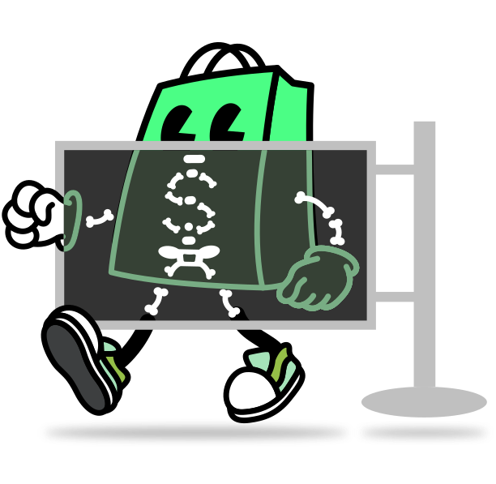

<h1 align="center" style="position: relative;">
  <br>
    
  <br>
  Shopify Skeleton Theme
</h1>

A minimal Shopify theme built on block-first composition. Templates compose each
page directly from blocks, snippets, and inline markup — no sections, no JSON
templates. It's designed to stay lean and to be edited by coding agents as
readily as by people.

<p align="center">
  <a href="./LICENSE.md"></a>
  <a href="./actions/workflows/ci.yml"></a>
</p>

## Getting started

### Prerequisites

Before starting, ensure you have the latest Shopify CLI installed:

- [Shopify CLI](https://shopify.dev/docs/api/shopify-cli) – helps you download, upload, preview themes, and streamline your workflows

If you use VS Code:

- [Shopify Liquid VS Code Extension](https://shopify.dev/docs/storefronts/themes/tools/shopify-liquid-vscode) – provides syntax highlighting, linting, inline documentation, and auto-completion specifically designed for Liquid templates

### Clone

Clone this repository using Git or Shopify CLI:

```bash
git clone git@github.com:Shopify/skeleton-theme.git
# or
shopify theme init
```

### Preview

Preview this theme using Shopify CLI:

```bash
shopify theme dev
```

## Theme architecture

```bash
.
├── assets          # Static assets, including critical.css (all theme CSS)
├── blocks          # Reusable, nestable, customizable UI components
├── config          # Global theme settings and customization options
├── layout          # Top-level page wrappers
├── locales         # Translation files for theme internationalization
├── snippets        # Reusable Liquid code or HTML fragments
└── templates       # Liquid composition roots, one per page type
```

To learn more, refer to the [theme architecture documentation](https://shopify.dev/docs/storefronts/themes/architecture).

## Block-first composition

Every page is composed from blocks. The composition flows in one direction:

```
templates/*.liquid →  → blocks / snippets / inline markup
```

### Templates

[Templates](https://shopify.dev/docs/storefronts/themes/architecture/templates#template-types)
control what's rendered on each type of page. In this theme they are Liquid
files (`templates/*.liquid`), not JSON. Each template is a composition root: it
wraps its page content in the `container` block and composes the rest from
blocks and inline markup.

For example, `templates/index.liquid` composes the `hello-world` block inside a
container:

```liquid

  

```

### Blocks

[Blocks](https://shopify.dev/docs/storefronts/themes/architecture/blocks) are
the theme's building units. Each block is a single file in `blocks/`, opens with
a `` header describing its parameters, and ends with a ``
(no `presets`). A block renders caller-supplied content through
`{{ block.content }}` and keeps `{{ block.shopify_attributes }}` on its root
element for theme-editor support.

The `container` block owns each page's outer layout element; `blocks/hello-world.liquid`
is the theme's starter demo block. `layout/theme.liquid` composes the `header`
and `footer` blocks directly, keeping the layout a thin shell.

## Non-negotiables

This theme deliberately excludes the section-based model. When editing it:

- No `sections/` directory, and no `` / `` tags.
- No JSON templates and no schema `presets`.
- No Liquid-embedded assets: keep CSS in `assets/critical.css` rather than
  `` / `` blocks.
- Compose pages from blocks and inline markup, not single-use page sections.

[`AGENTS.md`](./AGENTS.md) is the source of truth for the theme's dialect and the
full set of rules coding agents follow.

## CSS

All theme CSS lives in [`assets/critical.css`](./assets/critical.css), loaded
once from `layout/theme.liquid`. Keeping styles in one file — rather than
embedding them in Liquid — preserves the theme's minimalism and keeps blocks
markup-only.

## Contributing

We're excited for your contributions to the Skeleton Theme! This repository aims to remain as lean, lightweight, and fundamental as possible, and we kindly ask your contributions to align with this intention.

Visit our [CONTRIBUTING.md](./CONTRIBUTING.md) for a detailed overview of our process, guidelines, and recommendations.

## License

Skeleton Theme is open-sourced under the [MIT](./LICENSE.md) License.
