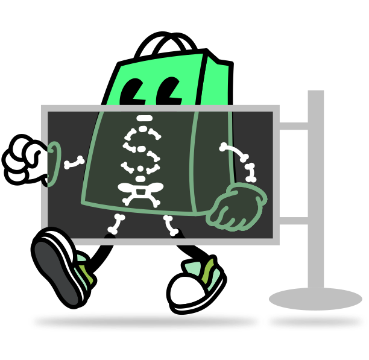

<h1 align="center" style="position: relative;">
  <br>
    
  <br>
  Shopify Skeleton Theme
</h1>

A minimal Shopify theme built on block-first composition. Templates compose each
page directly from blocks, snippets, and inline markup — no sections, no JSON
templates. It's designed to stay lean and to be edited by coding agents as
readily as by people.

<p align="center">
  <a href="./LICENSE.md"></a>
  <a href="./actions/workflows/ci.yml"></a>
</p>

## Getting started

### Prerequisites

Before starting, ensure you have the latest Shopify CLI installed:

- [Shopify CLI](https://shopify.dev/docs/api/shopify-cli) – helps you download, upload, preview themes, and streamline your workflows

If you use VS Code:

- [Shopify Liquid VS Code Extension](https://shopify.dev/docs/storefronts/themes/tools/shopify-liquid-vscode) – provides syntax highlighting, linting, inline documentation, and auto-completion specifically designed for Liquid templates

### Clone

Clone this repository using Git or Shopify CLI:

```bash
git clone git@github.com:Shopify/skeleton-theme.git
# or
shopify theme init
```

### Preview

Preview this theme using Shopify CLI:

```bash
shopify theme dev
```

## Theme architecture

```bash
.
├── assets          # CSS, JavaScript, and other static assets
├── blocks          # Reusable, customizable UI components
├── config          # Global theme settings and customization options
├── layout          # Top-level page wrappers
├── locales         # Translation files for theme internationalization
├── snippets        # Reusable Liquid code or HTML fragments
└── templates       # Liquid composition roots, one per page type
```

To learn more, refer to the [theme architecture documentation](https://shopify.dev/docs/storefronts/themes/architecture).

## Block-first composition

Every page is composed from blocks. The composition flows in one direction:

```
templates/*.liquid →  → blocks / snippets / inline markup
```

### Templates

[Templates](https://shopify.dev/docs/storefronts/themes/architecture/templates#template-types)
control what's rendered on each type of page. In this theme they are Liquid
files (`templates/*.liquid`), not JSON. Each template is a composition root:
it wraps its page content in one or more `container` blocks — one per vertical
slice — and composes blocks, snippets, and inline markup inside them. The layout
renders `content_for_layout` in a plain `<main>` and reserves the `container`
block for the header and footer only.

For example, `templates/index.liquid` wraps the `hello-world` block in a
container:

```liquid

  
    
  

```

### Blocks

[Blocks](https://shopify.dev/docs/storefronts/themes/architecture/blocks) are
the theme's building units. Each block is a single file in `blocks/`, opens with
a `` header describing its parameters, and ends with a ``
(no `presets`). A block renders caller-supplied content through
`{{ content }}` and keeps `{{ block.shopify_attributes }}` on its root
element for theme-editor support. Self-contained blocks can omit the content
outlet and accept an empty body.

Executable `` calls belong only in `layout/` and `templates/`.
Nested calls stay in the caller-owned body, rather than in block or snippet
implementations. The body renders in the caller's scope before the block
implementation; it cannot read that block's settings or local assignments.

Pass all parameters as plain named arguments:

```liquid

  {{ page.content }}

```

Every argument is a plain variable inside the block. Since the container
schema declares `alignment`, that argument also sets
`block.settings.alignment`: both reads return `center`. The `tag` argument
has no matching schema setting, so it is only the variable `tag`. `class`
is likewise an ordinary parameter with no special platform behavior.

LiquidDoc documents parameters; it does not declare, validate, or bind them.
Use schema settings for merchant-editable controls, and document whether body
content is required (`@param {string} content`) or optional
(`@param {string} [content]`). Prefer body content for display-only text and
markup; use parameters for data or choices that affect how a block renders.
Inline literal arrays, such as the `tips` list above, are supported by the
block tag; render and partial tags do not accept inline literal arrays.

The `container` block owns a page region's outer layout element. Each template
wraps its content in one or more `container` blocks, and `layout/theme.liquid`
wraps the `header` and `footer` blocks in their own containers while rendering
`content_for_layout` in a plain `<main>`. `blocks/hello-world.liquid` is the
theme's starter demo block.

## Non-negotiables

This theme deliberately excludes the section-based model. When editing it:

- No `sections/` directory, and no `` / `` tags.
- No JSON templates and no schema `presets`.
- No Liquid-embedded assets: keep all CSS and JavaScript in `assets/` rather
  `` / `` blocks.
- Compose pages from blocks and inline markup, not single-use page sections.
- Invoke blocks only in layouts and templates; render caller bodies with
  `{{ content }}` inside block implementations.

[`AGENTS.md`](./AGENTS.md) is the source of truth for the theme's dialect and the
full set of rules coding agents follow.

## CSS and JavaScript

All theme CSS and JavaScript live in [`assets/`](./assets/), rather than being
embedded in Liquid. This keeps blocks focused on markup without requiring
assets to live in a single file.

## Partial updates

Partials mark named regions of server-rendered HTML that JavaScript can update
without a full page reload. Wrap only the content that changes. In this theme,
`blocks/liquid-tips.liquid` wraps the tip sentence in
`...`, and
`assets/liquid-tips.js` updates it with:

```js
import { partials } from '@shopify/partial-rendering';

await partials.refresh('liquid-tip');
```

The Liquid region name and JavaScript target must match. `refresh()` fetches
and applies updates from the current page URL. Use `fetch()` followed by
`apply()` for control over the request or when the update appears, and fetch
related regions together. Build URLs from the current page URL or Liquid
`routes.*` so requests preserve locale and market routing.

`apply()` preserves focus, text selection, form values, and scroll position.
If the server corrects a form value, such as a cart quantity, explicitly update
the control after applying the partial; the returned markup alone does not
replace its preserved value. Cancel stale requests, provide loading feedback
and accessible announcements, and restore transient state such as open
disclosures. Read URL state from `window.location.search` for shared links
and browser navigation.

The partial tag currently requires `shop.features.agentic_editor_enabled?`
and StorefrontRenderer; otherwise the storefront raises
`Unknown tag 'partial'`.

## Contributing

We're excited for your contributions to the Skeleton Theme! This repository aims to remain as lean, lightweight, and fundamental as possible, and we kindly ask your contributions to align with this intention.

Visit our [CONTRIBUTING.md](./CONTRIBUTING.md) for a detailed overview of our process, guidelines, and recommendations.

## License

Skeleton Theme is open-sourced under the [MIT](./LICENSE.md) License.
